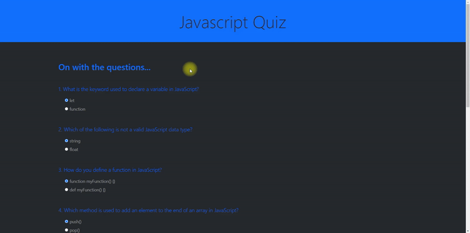

# Javascript Quiz

## Overview

This project is a dynamic web-based quiz application built with HTML, Bootstrap, and JavaScript. It offers users a series of questions about JavaScript fundamentals, with instant feedback on their answers. This interactive quiz is designed to test and improve the user's JavaScript knowledge through a user-friendly interface and engaging question set.

## Features

- **Interactive Questions**: Multiple-choice questions covering various JavaScript concepts.
- **Instant Feedback**: Users receive immediate feedback on their answers, enhancing the learning experience.
- **Responsive Design**: The quiz is fully responsive, providing an optimal viewing experience across a wide range of devices.
- **Score Tracking**: The application tracks the user's score, displaying results at the end of the quiz.

## Installation

1. Clone the repository to your local machine:

```bash
git clone <repository-url>
```

2. Open the `index.html` file in your browser to start the quiz.

## Usage

To take the quiz, simply:

1. Open the `index.html` file in a web browser.
2. Read the question and select your answer from the options provided.
3. Submit your answer to see immediate feedback.
4. Proceed through all the questions to see your final score.

## Adding a GIF Preview


